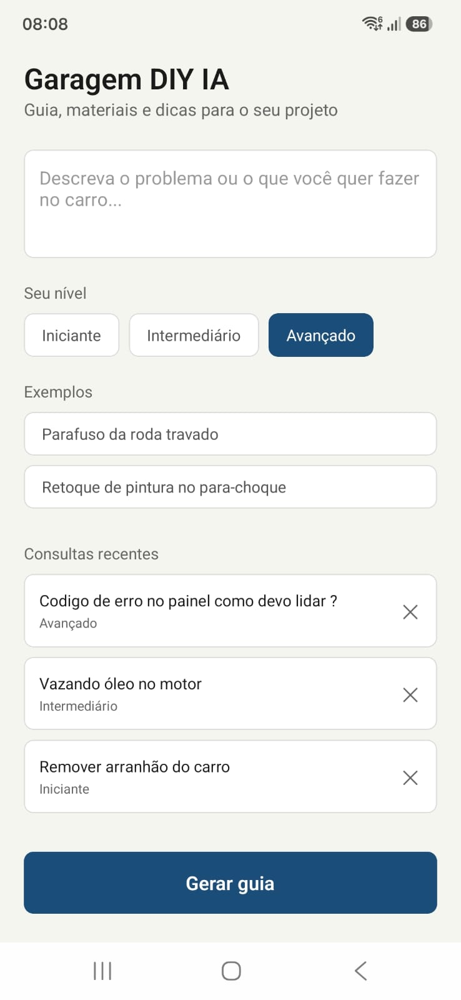
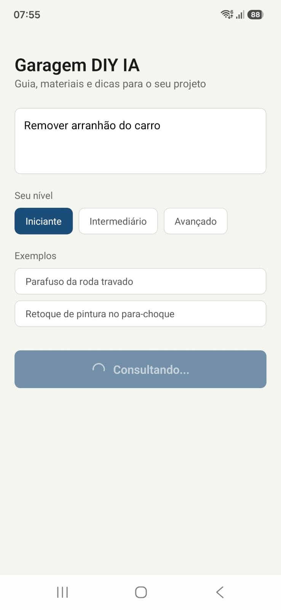
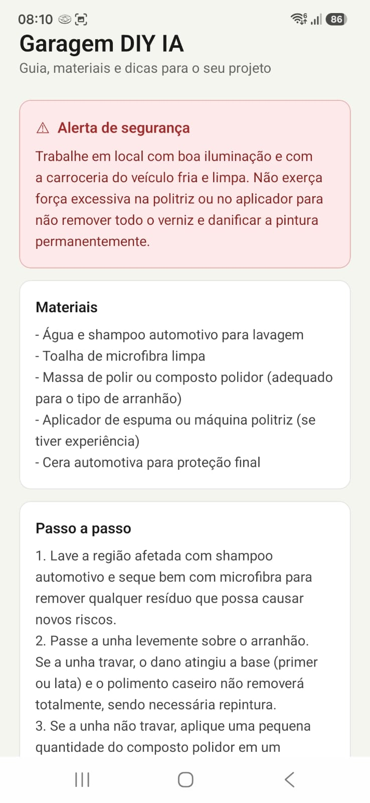

# Garagem DIY IA

Aplicativo em React Native que orienta trabalhos de mecânica e customização automotiva no estilo faça-você-mesmo. O usuário descreve um projeto ou um problema no carro e informa seu nível de experiência; a aplicação consulta uma API de inteligência artificial e devolve um guia estruturado com alerta de segurança, lista de materiais, passo a passo e uma dica técnica.

Trabalho desenvolvido individualmente para a disciplina de desenvolvimento de aplicações móveis.

## Demonstração

| Tela inicial | Consultando |
|---|---|
|  |  |

| Resultado | Dica de ouro |
|---|---|
|  |  |

## Funcionalidades

- Campo de texto livre para descrever o projeto ou o problema encontrado
- Seleção de nível de experiência (iniciante, intermediário, avançado) que altera a profundidade e a linguagem da resposta
- Exemplos clicáveis que preenchem o campo automaticamente
- Resposta organizada em quatro cards, com destaque visual para o alerta de segurança e para a dica técnica
- Histórico das três últimas consultas, salvo no aparelho, com reabertura instantânea e exclusão individual
- Indicador de carregamento durante a consulta, com bloqueio do botão para evitar requisições duplicadas
- Tratamento de erros com mensagens específicas para falha de conexão e para sobrecarga do serviço
- Botão físico de voltar do Android retorna à tela de entrada em vez de encerrar o aplicativo

## Tecnologias

- React Native com Expo (SDK 57)
- API do Google Gemini (`gemini-flash-lite-latest`) via `fetch`
- AsyncStorage para persistência local do histórico
- react-native-safe-area-context para respeitar as áreas seguras da tela

## Como executar

O projeto exige uma chave de API do Google AI Studio, gratuita e obtida em poucos passos.

**1. Clone o repositório e instale as dependências**

```bash
git clone https://github.com/diegomedeiros99/garagem-diy-ia.git
cd garagem-diy-ia
npm install
```

**2. Gere uma chave de API**

Acesse [aistudio.google.com](https://aistudio.google.com), faça login com uma conta Google e clique em "Get API key". Não é necessário cartão de crédito.

**3. Configure o arquivo de ambiente**

Crie um arquivo `.env` na raiz do projeto, seguindo o modelo de `.env.example`:

```
EXPO_PUBLIC_GEMINI_API_KEY=sua_chave_aqui
```

**4. Inicie o projeto**

```bash
npx expo start
```

Instale o aplicativo Expo Go no celular e escaneie o QR Code exibido no terminal. O celular e o computador precisam estar na mesma rede.

## Estrutura do projeto

```
garagem-diy-ia/
├── src/
│   ├── components/
│   │   ├── CardResultado.js
│   │   ├── Chip.js
│   │   └── ItemHistorico.js
│   ├── screens/
│   │   └── HomeScreen.js
│   ├── services/
│   │   ├── aiService.js
│   │   └── historico.js
│   └── theme/
│       └── cores.js
├── App.js
└── .env.example
```
src/components   Componentes visuais reutilizáveis
src/screens      Telas da aplicação
src/services     Comunicação com a API e persistência local
src/theme        Paleta de cores e medidas compartilhadas
App.js           Ponto de entrada
.env.example     Modelo de configuração

A separação segue o princípio de isolar responsabilidades. Os componentes desconhecem a origem dos dados; a tela chama `consultarMecanico()` sem saber como a requisição é feita; toda a integração com a API vive em um único arquivo. Trocar o provedor de IA exigiria alterar apenas `aiService.js`.

## Decisões técnicas

**Formato de resposta com marcadores em vez de JSON.** O modelo é instruído a devolver o texto separado por marcadores como `[ALERTA]` e `[MATERIAIS]`. JSON seria mais elegante, mas uma vírgula fora do lugar quebraria o `JSON.parse` e derrubaria a aplicação. A função de separação tolera marcadores ausentes e, em último caso, exibe o texto integral em vez de deixar a tela vazia.

**Alerta de segurança sempre presente.** O prompt torna esse campo obrigatório, inclusive em tarefas de baixo risco. Mecânica automotiva envolve riscos reais, e omitir a precaução quando ela parece desnecessária seria a decisão errada.

**Proibição explícita de inventar especificações.** Modelos de linguagem produzem valores de torque e capacidade de fluidos com confiança mesmo quando não os conhecem. O prompt determina que esses números nunca sejam gerados, e que o usuário seja remetido ao manual do veículo.

**Escolha do modelo.** Os testes começaram com `gemini-3-flash-preview`, que apresentou recusas frequentes por alta demanda e tempos de resposta acima de quinze segundos no nível avançado. O `gemini-flash-lite-latest` mostrou-se mais rápido e disponível, ao custo de eventual inconsistência de acentuação nas respostas geradas — limitação considerada aceitável diante do ganho de confiabilidade.

**Busca na web desativada.** A API oferece integração com o Google Search, que melhora a precisão em perguntas específicas, como códigos de erro de modelos determinados. O recurso foi deixado de fora para reduzir a complexidade da integração e por ter cobrança própria, separada do consumo de tokens.

**Chave de API no cliente.** A variável `EXPO_PUBLIC_GEMINI_API_KEY` é embutida no pacote da aplicação, o que não constitui segredo em um app publicado. A solução correta seria um servidor intermediário responsável pelas chamadas. Para o escopo deste trabalho, o arquivo `.env` fora do controle de versão atende ao propósito de não expor a chave no repositório.

**Botão voltar do Android.** O tratamento via `BackHandler` não se aplica ao iOS, que não possui botão equivalente. O aplicativo foi testado apenas em Android.

## Autor

Diego Medeiros
